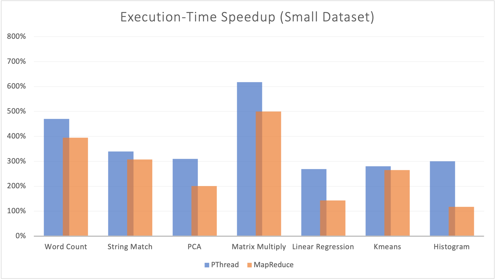
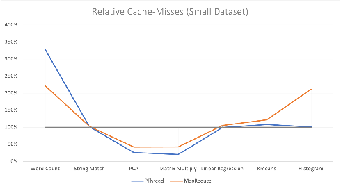
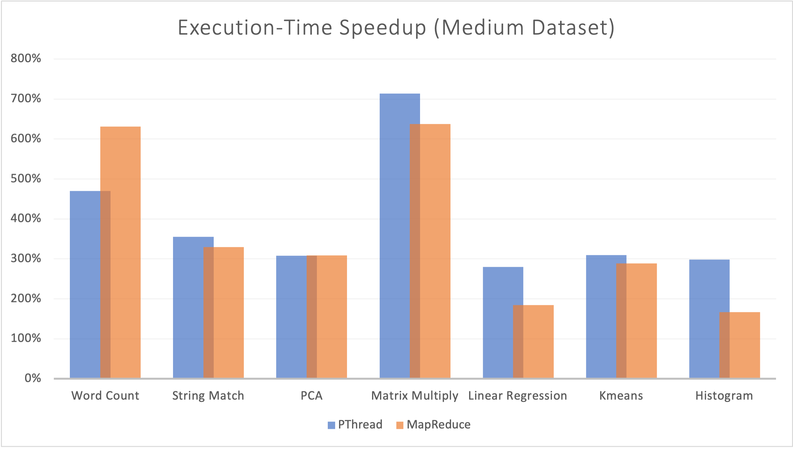
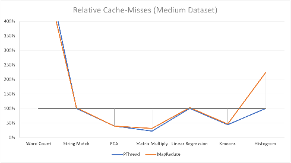

# Setup
These benchmarks have been evaluated on a Huawei Matebook X Pro 2019. The Specification are as follows:
-  Intel Core i5-8265U CPU
   -  Core-number: 4
   -  Thread-number: 8
   -  Cache-size: 
      -  L1: 256 KiB
      -  L2: 1 MiB
      -  L3: 6 MiB
-  Arch-Linux version 2021.05.01
-  Linux kernel version 2.11.16
-  GCC-version: 10.2.0
-  Make-version: 
- Profiling-tool: [perf](https://man7.org/linux/man-pages/man1/perf.1.html)


# Execution

## <u>**Phoenix**</u>
The implementation of Phoenix as well as the input files have been directly taken 
from https://github.com/kozyraki/phoenix!

### **Run Phoenix**
To succesfully run the Phoenix benchmarks you need to download the input files.

You can get them here:
- [Histogram Files](http://home.in.tum.de/~wangt/seminar/data/histogram.tar.gz) ~500MB
- [Linear Regression Files](http://home.in.tum.de/~wangt/seminar/data/linear_regression.tar.gz) ~200MB
- [String Matchin Files](http://home.in.tum.de/~wangt/seminar/data/string_match.tar.gz) ~200MB
- [Word Count Files](http://home.in.tum.de/~wangt/seminar/data/word_count.tar.gz) ~50MB

Programs without input files will create random data to evaluate.

Extract them with tar: 
``` bash
$ tar -zxvf *.tar.gz
```

Move the folders into the respective subdirectory:
``` bash
$ mv histogram_datafiles tests/histogram/
$ mv linear_regression_datafiles tests/linear_regression/
$ mv string_match_datafiles tests/string_match/
$ mv word_count_datafiles tests/word_count/
```

Before you can execute something, you need to compile everything:
``` bash
$ cd tests # switch to the tests/ directory
$ make # compiles everything
```

Now that you have compiled everything and placed the input files in the correct directories, you can start benchmarking.  
To execute the benchmarks for every program, first change into the respective directory:
``` bash
$ cd word_count # this example is for the "word_count" program
```
In here you have three bash scripts: `run_sequential.sh`, `run_pthread.sh`, `run_map_reduce.sh`. Each of them executes the respective program 10 times and outputs the result with <samp>perf</samp>. You can execute them with:
``` bash
$ sh run_sequential.sh # runs the sequential implementation
$ sh run_pthread.sh # runs the pthread implementation
$ sh run_map_reduce.sh # runs the mapreduce implementation
```
These steps are analogous for: <samp>histogram, kmeans, linear_regression, matrix_multiply, pca</samp> and <samp>string_match</samp>.

___

## <u>**Parsec**</u>
<br>
<details>
<summary><font size = "+1"><b>Installing Parsec</b></font size></summary>

  Download PARSEC 3.0 directly from the princeton website:
  ``` bash
  $ wget http://parsec.cs.princeton.edu/download/3.0/parsec-3.0.tar.gz
  ```

  Unpack PARSEC 3.0 package:
  ``` bash
  $ tar -xzf parsec-3.0.tar.gz
  $ cd parsec-3.0
  ```

  Setup environment variable (requires bash):
  ``` bash
  $ bash && source env.sh
  ```

  Building workloads can be done with: `parsecmgmt -a build -p [suite].[PACKAGE] -c [BUILD-CONFIGURATION]`  

  In this assignment we use seven different workloads with the both serial and parallel version:
  1. <samp>Blackscholes</samp>
  2. <samp>Canneal</samp>
  3. <samp>Fluidanimate</samp>
  4. <samp>Freqmine</samp>
  5. <samp>Raytrace</samp>
  6. <samp>Streamcluster</samp>
  7. <samp>Vips</samp>

  Therefore to build all these workloads, simply run the following commands:
  ``` bash
  $ parsecmgmt -a build -p parsec.blackscholes -c gcc # builds default parallel version of blackscholes workload with gcc
  $ parsecmgmt -a build -p parsec.blackscholes -c gcc-serial # builds the serial version with gcc
  $ parsecmgmt -a build -p parsec.canneal -c gcc # builds default parallel version of canneal workload with gcc
  $ parsecmgmt -a build -p parsec.canneal -c gcc-serial # builds the serial version with gcc
  $ parsecmgmt -a build -p parsec.fluidanimate -c gcc # builds the default parallel version of fluidanimate workload with gcc
  $ parsecmgmt -a build -p parsec.fluidanimate -c gcc-serial # builds the serial version with gcc
  $ parsecmgmt -a build -p parsec.freqmine -c gcc # builds the default parallel version of freqmine workload with gcc
  $ parsecmgmt -a build -p parsec.freqmine -c gcc-serial # builds the serial version with gcc
  $ parsecmgmt -a build -p parsec.raytrace -c gcc # builds the default parallel version of raytrace workload with gcc
  $ parsecmgmt -a build -p parsec.raytrace -c gcc-serial # builds the serial version with gcc
  $ parsecmgmt -a build -p parsec.streamcluster -c gcc # builds the default parallel version of streamcluster workload with gcc
  $ parsecmgmt -a build -p parsec.streamcluster -c gcc-serial # builds the serial version with gcc
  $ parsecmgmt -a build -p parsec.vips -c gcc # builds the default parallel version of vipsworkload with gcc
  $ parsecmgmt -a build -p parsec.vips -c gcc-serial # builds the serial version with gcc
  ```

  Great! Now we have installed everything we need.  

</details>
<br>

### **Run Parsec**

After everything is installed, we can run the benchmarks very handy from the commandline. 

The commandline arguments are: `parsecmgmt -a run -p [suite].[PACKAGE] -c [BUILD-CONFIGURATION] -i [INPUT-SIZE] -n [THREAD#]`

To recreate the benchmarks in this assignment, use the following commands:

Example for the <samp>blackscholes</samp> workload:
``` bash
$ parsecmgmt -a run -p parsec.blackscholes -c gcc-serial -i simsmall # run the serial version with a small workload
$ parsecmgmt -a run -p parsec.blackscholes -c gcc-serial -i simlarge # run the serial version with a large workload
$ parsecmgmt -a run -p parsec.blackscholes -c gcc -i simsmall -n 4
# run the parallel version of blackscholes prorgram with a small workload and 4 threads
$ parsecmgmt -a run -p parsec.blackscholes -c gcc -i simlarge -n 4
# run the parallel version of blackscholes prorgram with a large workload and 4 threads
$ parsecmgmt -a run -p parsec.blackscholes -c gcc -i simsmall -n 8
# run the parallel version of blackscholes prorgram with a small workload and 8 threads
$ parsecmgmt -a run -p parsec.blackscholes -c gcc -i simlarge -n 8
# run the parallel version of blackscholes prorgram with a large workload and 8 threads
```

These commands can be run analogoulsy for the other packages: <samp>canneal, fluidanimate, freqmine, raytrace, streamcluster, vips</samp>.

# Plots

 ## <p align="center"><u> **Phoenix** </u></p>


<p align="center">
   
</p>
<p align="center">
  On the left: lkjsdflk On the right: lkjsldkfjier
</p>

<p align="center">
   
</p>
<p align="center">
  On the left: lkjsdflk On the right: lkjsldkfjier
</p>


## <u>**Parsec**</u>

# Description

## <u>**Phoenix**</u>

## <u>**Parsec**</u>

### **Workloads Overview**

| Workload        | Application Domain | Parallelization-Model | Parallelization-Granularity | Working Set | Data Usage Sharing | Data Usage Exchange |
| --------------- | ------------------ | --------------------- | --------------------------- | ----------- | ------------------ | ------------------- |
| `blackscholes`  | Financial Analysis | data-parallel         | coarse                      | small       | low                | low                 |
| `canneal`       | Computer Vision    | unstructured          | fine                        | unbounded   | high               | high                |
| `fluidanimate`  | Animation          | data-parallel         | fine                        | large       | low                | medium              |
| `freqmine`      | Data Mining        | data-parallel         | medium                      | unbounded   | high               | medium              |
| `raytrace`      | Rendering          | data-parallel         | medium                      | unbounded   | high               | low                 |
| `streamcluster` | Data Mining        | data-parallel         | medium                      | medium      | low                | medium              |
| `vips`          | Media Processing   | data-parallel         | coarse                      | medium      | low                | medium              |

**Table 1** Key Characteristics of the different workloads used in this assignment taken from *Benchmarking Modern Multiprocessors, Christian Bienia, Ph.D. Thesis, 2011*

