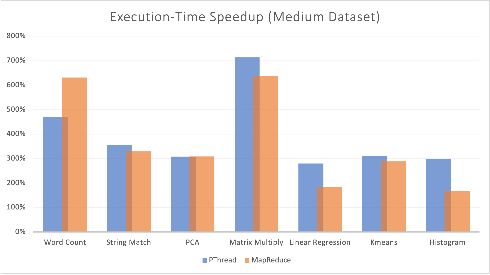
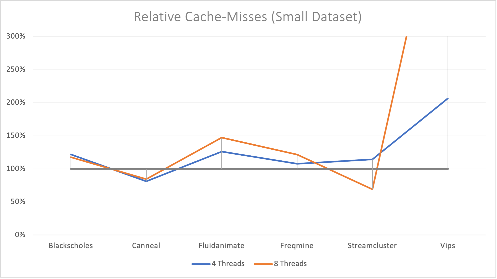
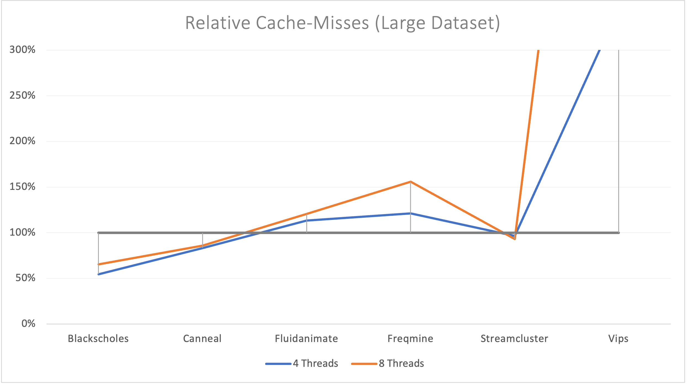

The contents of this assignment are based on:
- [Evaluating MapReduce for Multi-core and Multiprocessor Systems](https://ieeexplore.ieee.org/document/4147644),
*International Symposium on High Performance Computer Architecture (HPCA), 2007*
- [Benchmarking Modern Multiprocessors](https://parsec.cs.princeton.edu/publications/bienia11benchmarking.pdf), *Christian Bienia, Ph.D. Thesis, 2011*


# Setup
These benchmarks have been evaluated on a Huawei Matebook X Pro 2019. The Specification are as follows:
-  Intel Core i5-8265U CPU
   -  Core-number: 4
   -  Thread-number: 8
   -  Cache-size: 
      -  L1: 256 KiB
      -  L2: 1 MiB
      -  L3: 6 MiB
-  Linux kernel version 5.12.3-arch1-1
-  GCC-version: 10.2.0
-  Make-version: 4.3
- Profiling-tool: [perf](https://man7.org/linux/man-pages/man1/perf.1.html)

For *Parsec* the default datasets have been used, for *Phoenix* the following have been used:
## <u>**Phoenix**</u>
| Application | Datasets
| --- | --- |
| `Word Count` | S: 10MB, M: 50MB, L:100MB
| `Matrix Multiply` | S: 500x500, M: 750x750, L: 1000x1000
| `Kmeans` | S: 2<sup>28</sup>, M: 2<sup>31</sup>, L: 2<sup>32</sup> Points
| `String Match` | S: 50MB, M: 100MB, L: 500MB
| `PCA` | S: 1024x4096, M: 2048x8192, L: 4096x16384
| `Histogram` | S: 100MB, M: 400MB, L: 1.4GB
| `Linear Regression` | S: 50MB, M: 100MB, L: 500MB

For the *Phoenix* applications, multi-threaded programs have been executed with all 8 threads.

<br>

## <u>**Parsec**</u>
| Workload | Datasets
| --- | --- |
| `blackscholes`  | S: 4,096; L: 65,546 options
| `canneal`       | S: 10k swaps, 2,000˚C start temp., 100k netlist elem., 32 temp. steps; L: 15k swaps, 2,000˚C start temp., 400k netlist elem., 128 temp. steps
| `fluidanimate`  | S: 35,000 particles, 5 frames; L: 300,000 particles, 5 frames
| `freqmine`      | S: Database with 250k anonymized click streams; L: Database with 990k click streams
| `raytrace`      | S: 480x270 pixels, 1 Mio. polygons, 3 frames; L: 1,920x1,080 pixels, 10 Mio. polygons, 200 frames
| `streamcluster` | 4,096 input points, block size 4,096 points, 32 point dimensions, 10-20 centers; L: 16,384 input points, block size 16,384 points, 128 point dimensions
| `vips`          | S: 1,600x1,200 pixels; L: 2,662x5,500 pixels


<br></br>

# Execution

## <u>**Phoenix**</u>
The implementation of Phoenix as well as the input files have been directly taken 
from https://github.com/kozyraki/phoenix!

### **Run Phoenix**
To succesfully run the Phoenix benchmarks you need to download the input files.

You can get them here:
- [Histogram Files](http://home.in.tum.de/~wangt/seminar/data/histogram.tar.gz) ~500MB
- [Linear Regression Files](http://home.in.tum.de/~wangt/seminar/data/linear_regression.tar.gz) ~200MB
- [String Matchin Files](http://home.in.tum.de/~wangt/seminar/data/string_match.tar.gz) ~200MB
- [Word Count Files](http://home.in.tum.de/~wangt/seminar/data/word_count.tar.gz) ~50MB

Programs without input files will create random data to evaluate.

Extract them with tar: 
``` bash
$ tar -zxvf *.tar.gz
```

Move the folders into the respective subdirectory:
``` bash
$ mv histogram_datafiles tests/histogram/
$ mv linear_regression_datafiles tests/linear_regression/
$ mv string_match_datafiles tests/string_match/
$ mv word_count_datafiles tests/word_count/
```

Before you can execute something, you need to compile everything:
``` bash
$ cd tests # switch to the tests/ directory
$ make # compiles everything
```

Now that you have compiled everything and placed the input files in the correct directories, you can start benchmarking.  
To execute the benchmarks for every program, first change into the respective directory:
``` bash
$ cd word_count # this example is for the "word_count" program
```
In here you have three bash scripts: `run_sequential.sh`, `run_pthread.sh`, `run_map_reduce.sh`. Each of them executes the respective program 10 times and outputs the result with <samp>perf</samp>. You can execute them with:
``` bash
$ sh run_sequential.sh # runs the sequential implementation
$ sh run_pthread.sh # runs the pthread implementation
$ sh run_map_reduce.sh # runs the mapreduce implementation
```
These steps are analogous for: <samp>histogram, kmeans, linear_regression, matrix_multiply, pca</samp> and <samp>string_match</samp>.

___

## <u>**Parsec**</u>
<br>
<details>
<summary><font size = "+1"><b>Installing Parsec</b></font size></summary>

  Download PARSEC 3.0 directly from the princeton website:
  ``` bash
  $ wget http://parsec.cs.princeton.edu/download/3.0/parsec-3.0.tar.gz
  ```

  Unpack PARSEC 3.0 package:
  ``` bash
  $ tar -xzf parsec-3.0.tar.gz
  $ cd parsec-3.0
  ```

  Setup environment variable (requires bash):
  ``` bash
  $ bash && source env.sh
  ```

  Building workloads can be done with: `parsecmgmt -a build -p [suite].[PACKAGE] -c [BUILD-CONFIGURATION]`  

  In this assignment we use seven different workloads with the both serial and parallel version:
  1. <samp>Blackscholes</samp>
  2. <samp>Canneal</samp>
  3. <samp>Fluidanimate</samp>
  4. <samp>Freqmine</samp>
  5. <samp>Raytrace</samp>
  6. <samp>Streamcluster</samp>
  7. <samp>Vips</samp>

  Therefore to build all these workloads, simply run the following commands:
  ``` bash
  $ parsecmgmt -a build -p parsec.blackscholes -c gcc # builds default parallel version of blackscholes workload with gcc
  $ parsecmgmt -a build -p parsec.blackscholes -c gcc-serial # builds the serial version with gcc
  $ parsecmgmt -a build -p parsec.canneal -c gcc # builds default parallel version of canneal workload with gcc
  $ parsecmgmt -a build -p parsec.canneal -c gcc-serial # builds the serial version with gcc
  $ parsecmgmt -a build -p parsec.fluidanimate -c gcc # builds the default parallel version of fluidanimate workload with gcc
  $ parsecmgmt -a build -p parsec.fluidanimate -c gcc-serial # builds the serial version with gcc
  $ parsecmgmt -a build -p parsec.freqmine -c gcc # builds the default parallel version of freqmine workload with gcc
  $ parsecmgmt -a build -p parsec.freqmine -c gcc-serial # builds the serial version with gcc
  $ parsecmgmt -a build -p parsec.raytrace -c gcc # builds the default parallel version of raytrace workload with gcc
  $ parsecmgmt -a build -p parsec.raytrace -c gcc-serial # builds the serial version with gcc
  $ parsecmgmt -a build -p parsec.streamcluster -c gcc # builds the default parallel version of streamcluster workload with gcc
  $ parsecmgmt -a build -p parsec.streamcluster -c gcc-serial # builds the serial version with gcc
  $ parsecmgmt -a build -p parsec.vips -c gcc # builds the default parallel version of vipsworkload with gcc
  $ parsecmgmt -a build -p parsec.vips -c gcc-serial # builds the serial version with gcc
  ```

  Great! Now we have installed everything we need.  

</details>
<br>

### **Run Parsec**

After everything is installed, we can run the benchmarks very handy from the commandline. 

The commandline arguments are: `parsecmgmt -a run -p [suite].[PACKAGE] -c [BUILD-CONFIGURATION] -i [INPUT-SIZE] -n [THREAD#]`

To recreate the benchmarks in this assignment, use the following commands:

Example for the <samp>blackscholes</samp> workload:
``` bash
$ parsecmgmt -a run -p parsec.blackscholes -c gcc-serial -i simsmall # run the serial version with a small workload
$ parsecmgmt -a run -p parsec.blackscholes -c gcc-serial -i simlarge # run the serial version with a large workload
$ parsecmgmt -a run -p parsec.blackscholes -c gcc -i simsmall -n 4
# run the parallel version of blackscholes prorgram with a small workload and 4 threads
$ parsecmgmt -a run -p parsec.blackscholes -c gcc -i simlarge -n 4
# run the parallel version of blackscholes prorgram with a large workload and 4 threads
$ parsecmgmt -a run -p parsec.blackscholes -c gcc -i simsmall -n 8
# run the parallel version of blackscholes prorgram with a small workload and 8 threads
$ parsecmgmt -a run -p parsec.blackscholes -c gcc -i simlarge -n 8
# run the parallel version of blackscholes prorgram with a large workload and 8 threads
```

These commands can be run analogoulsy for the other packages: <samp>canneal, fluidanimate, freqmine, raytrace, streamcluster</samp>, and<samp> vips</samp>.

<br></br>

# Plots

 ## <p align="center"><u> **Phoenix** </u></p>

&nbsp;&nbsp;&nbsp;&nbsp; All the implementations in these plots are compared with the respective sequential version. 
<p align="center" style="line-height:0.5">
   
</p>
<p align="left">
  &nbsp;&nbsp;&nbsp;&nbsp;<b>Left Figure 1.1:</b> relative execution time speed-up on small datasets&emsp;<b> Right Figure 1.2:</b> relative cache misses on small datasets
</p>

<br>

<p align="center" style="line-height:0.5">
   
</p>
<p align="left">
  &nbsp;&nbsp;&nbsp;&nbsp;<b>Left Figure 2.1:</b> relative execution time speed-up on med. datasets<b>&emsp; Right Figure 2.2:</b> relative cache misses on medium datasets
</p>

<br>

<p align="center" style="line-height:0.5">
   
</p>
<p align="left">
  &nbsp;&nbsp;&nbsp;&nbsp;<b>Left Figure 3.1:</b> relative execution time speed-up on large datasets&emsp;<b> Right Figure 3.2:</b> relative cache misses on large datasets
</p>


<br>


## <p align="center"><u> **Parsec** </u></p>

&nbsp;&nbsp;&nbsp;&nbsp; <i>Raytrace was not able to run with multiple threads, therefore no data could be gathered.</i>
<p align="center" style="line-height:0.5">
   
</p>
<p align="left">
  &nbsp;&nbsp;&nbsp;&nbsp;<b>Left Figure 4.1:</b> relative time speed-up on small datasets&emsp;&emsp;&emsp;&emsp;&emsp;&emsp;<b>Right Figure 4.2:</b> relative cache misses on small datasets
</p>

<br>

<p align="center" style="line-height:0.5">
   
</p>
<p align="left">
  &nbsp;&nbsp;&nbsp;&nbsp;<b>Left Figure 5.1:</b> relative time speed-up on large datasets&emsp;&emsp;&emsp;&emsp;&emsp;&emsp;<b>Right Figure 5.2:</b> relative cache misses on large datasets
</p>

<br></br>

# Description

## <u>**Phoenix**</u>
<br>

### **Applications Overview**


| Application | Description | Code Size Ratio: PThread / Phoenix
| --- | --- | --: |
| `Word Count` | Determine frequency of words in a file | 1.8 / 0.9
| `Matrix Multiply` | Dense integer matrix multiplication | 1.8 / 2.2
| `Kmeans` | Iterative clustering algorithm to classify 3D data points into groups | 1.2 / 1.7
| `String Match` | Search file with keys for an encrypted word | 1.8 / 1.5
| `PCA` | Principal components analysis on a matrix | 1.7 / 2.5
| `Histogram` | Determine frequency of each RGB component in a set of images | 2.4 / 2.2
| `Linear Regression` | Compute the best fit line for a set of points | 1.7 / 1.6

Relative code size compared with the respective sequential implementation

As expected, the applications that ran with multi-threaded implementations were all faster than the sequential versions, in every application, and every data size. However, both the Pthread and MapReduce variants differ in few aspects, which we want to investigate further now.

- It is noticable in *Figure 1.1* that MapReduce has a slower speed-up than the PThread implementation in every application. This is due to the fact that the whole execution time is compared.
MapReduce needs to setup splitter arguments, the MapReduce arguments and call the MapReduce scheduler. If the input is small enough, this can create a lot of overhead, for the programs needs longer to manage and set everything up than the actual computation. Still, MapReduce is a lot faster than the sequential version in most applications.

- Matrix Multiplication has always been a target for multi-threaded applications, since they are almost perfect for parallel programming. It is no surprise that this application has one of the best speed-up (*Figure 1.1, 2.1*). The better cache-locality (*Figure 1.2, 2.2*) is due to the fact that the input matrix is still small enough to be placed in the L3-Cache. However, as in *Figure 3.1* and *Figure 3.2* shown, the performance is getting worse if the matrices are getting too big. For they can not fit into the cache anymore and thus the cache-miss rate is getting higher, leading to a dropdown in speed-up from ~650% down to ~150% using the large dataset.

- The 7.5 speedup of *Word Count* (*Figure 3.1*) is due to its key-based structure, which MapReduce can benefit hugely from, making it also much faster than the PThread implementation. Even though, it is the application with the most cache-misses, it can amortize this overhead with its seperation between the mapping phase and reduce phase. 

- This key-based structure also fits well the *String Match* algorithm, which benefits greatly from the parallelization. While the cache-misses are similar to the sequential version, it ranges speedups up to 350% (*Figure 1.1, 2.1, 3.1*). Both the PThread and MapReduce implementation.

- Remarkable is the surprising MapReduce speedup in the *PCA* application with a large dataset (*Figure 3.1*), since the MapReduce implementation is behind the PThread implementation with small and medium datasets (*Figure 1.1, 2.1*). The surprising speedup is because of the large input size (4096x16384). The PThread implementation uses the original array structure for direct access, which can lead to an overhead if the arrays get too big, hence the PThread implementation has a worse cache-miss rate (*Figure 3.2*). Whereas the MapReduce implementation operates mostly on pointers and can therefore reduce its overhead.

- Even though the rest of the applications (*Linear Regression, Kmeans, Histogram*) achieve speedups up to ~300%, the PThread implementation and MapReduce implementation are comparable in performance, or the MapReduce implementation is even slightly worse. This is because these algorithms do not fit very well with the MapReduce program structure. The *Kmeans* algorithm calls the MapReduce scheduler iteratively, giving it a slight disatvantage against the PThread implementation. In contrary to the MapReduce implementation, the PThread implementation of the *histogram* application does not use keys as output format additionally, it omits the final sorting of the output data, unlike the MapReduce implementation, resulting in a greatly reduced overhead, better performance and better cache-locality (*Figure 1 - 3*)

- Multicore implementations are, naturally, far better and faster than the respective sequential versions. Whereas MapReduce can be quite attractive in some domains, it is far from perfect and can not cover every application. However, it can lead to solid parallel efficiency with less LOC than the PThread implementation, and in some cases can outperform PThreads by far, if the MapReduce implementation can benefit from the application's structure.

<br></br>

## <u>**Parsec**</u>

### **Workloads Overview**

| Workload        | Application Domain | Parallelization-Model | Parallelization-Granularity | Working Set | Data Usage Sharing | Data Usage Exchange |
| --------------- | ------------------ | --------------------- | --------------------------- | ----------- | ------------------ | ------------------- |
| `blackscholes`  | Financial Analysis | data-parallel         | coarse                      | small       | low                | low                 |
| `canneal`       | Computer Vision    | unstructured          | fine                        | unbounded   | high               | high                |
| `fluidanimate`  | Animation          | data-parallel         | fine                        | large       | low                | medium              |
| `freqmine`      | Data Mining        | data-parallel         | medium                      | unbounded   | high               | medium              |
| `raytrace`      | Rendering          | data-parallel         | medium                      | unbounded   | high               | low                 |
| `streamcluster` | Data Mining        | data-parallel         | medium                      | medium      | low                | medium              |
| `vips`          | Media Processing   | data-parallel         | coarse                      | medium      | low                | medium              |

<u>Table 2</u> Key Characteristics of the different workloads used in this assignment taken from *Benchmarking Modern Multiprocessors, Christian Bienia, Ph.D. Thesis, 2011*

- Similar to the Phoenix benchmark, every multicore program performs faster than the respective singlecore program, except for the *Canneal* workload with small datasets (*Figure 4.1*). 
  
- Small datasets can always be tricky for parallel programs, for they can have more managing-overhead. While the *Canneal* workload has one of the lowest cache-miss rate, it still performs even worse than the sequential version with small datasets. This might be due to the parallelization-model (*Table 2*), for it is the only workload with an unstructured parallelization-model. However, the dataset might also simply be too small, since the speedup is increasing with the large dataset again.

- The cache-misses of the *Vips* workload exceed those of the sequential version by more than 400% (*Figure 4.2, 5.2*). This workload includes 18 stages, most of them being matrix operations and convolution, which explains the noticeable speedup with more threads. However, with multiple threads an big inputs, every thread can load different data into the cache everytime in random order, which can result very bad cache locality. If the order of the operations could be optimized towards cache locality, the speedups will be even faster.

- The *Streamcluster* workload achieves a huge bump in speed from shy under 100% with small datasets to 450% speedup with large datasets. This is also because the input size is too small. The computation of this workload are very primitive, so the program is memory bound for small data sizes, and gets more computation bound the bigger the input data gets. With an increasing dimensionality of the input data, the cores can be used much more efficiently, resulting in a greater speed-up.

- The other workloads (*Blackscholes, Fluidanimate, Freqmine*) follow strictly the trend of increasing the performance the more threads are used and larger the dataset is.

- Parsec is a very diverse benchmark suite, with various workloads from different areas. These benchmarks can characterize these programs from different domains depending on their hardware environment. It would be interesting to test them on a machine with more than 8 threads to learn if there is a saturation point of performance regarding the number of threads.